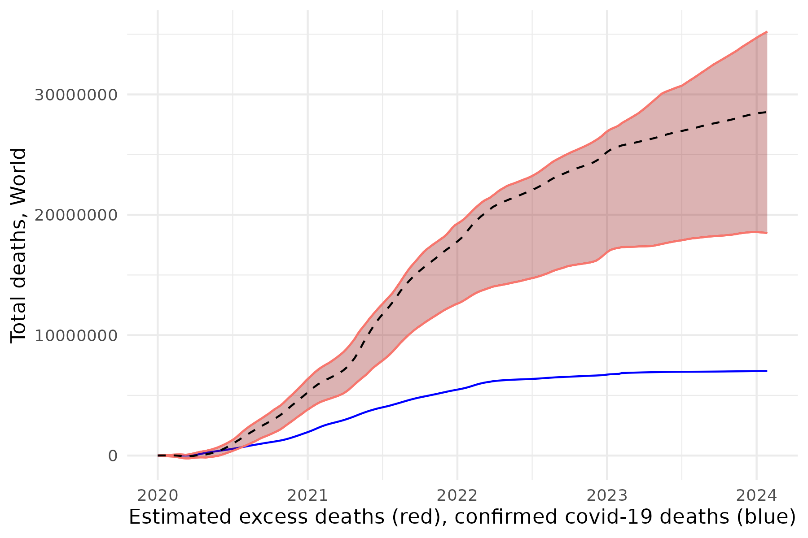

# The Economist's excess deaths model

[](https://github.com/TheEconomist/covid-19-the-economist-global-excess-deaths-model/actions/workflows/update.yaml)

This repository contains the replication code and data for *The Economist*'s excess deaths model, used to estimate excess deaths due to the covid-19 pandemic.  

  

## Getting started

Before running the R scripts, please install all the dependencies listed in [this file](https://github.com/TheEconomist/covid-19-the-economist-global-excess-deaths-model/blob/main/scripts/list_of_required_packages.txt).

Keep in mind that you need to use a modified development version of [agtboost](https://github.com/sondreus/agtboost/R-package), which has been rewritten to load machine learning ensembles faster (our approach requires loading 210 of these).

To install it, first install the devtools package:

```r
install.packages('devtools')
```

And then install the development version from GitHub:

```r
devtools::install_github("sondreus/agtboost/R-package")
```

## Running the models

To update the model dynamically on a daily basis, run [`scripts/0_excess_deaths_global_estimates_autoupdater.R`](https://github.com/TheEconomist/covid-19-the-economist-global-excess-deaths-model/blob/main/scripts/0_excess_deaths_global_estimates_autoupdater.R) (from the main directory). This will generate update excess deaths estimates for every country and territory from Jan 1st 2020 until the present.

To replicate the model and export estimated excess deaths for a locality, please run the scripts [1](https://github.com/TheEconomist/covid-19-the-economist-global-excess-deaths-model/blob/main/scripts/1_excess_deaths_global_estimates_data_generation.R), [2](https://github.com/TheEconomist/covid-19-the-economist-global-excess-deaths-model/blob/main/scripts/2_excess_deaths_global_estimates_model.R), and [3](https://github.com/TheEconomist/covid-19-the-economist-global-excess-deaths-model/blob/main/scripts/3_excess_deaths_global_estimates_export.R), in the scripts folder. As the model draws most of its data dynamically, you can also use these scripts to generate updated estimates and models as time passes.

- To read about what the model shows, see our [Briefing: Counting the dead.](https://www.economist.com/briefing/2021/05/15/there-have-been-7m-13m-excess-deaths-worldwide-during-the-pandemic)     
- To understand how we constructed it, see our [Methodology: How we estimated the true death toll of the pandemic.](https://www.economist.com/ExcessDeathsModel).  
- To see all the improvements we have made since, as well as all our estimates, updated daily, see our [Interactive: The pandemic’s true death toll](https://www.economist.com/graphic-detail/coronavirus-excess-deaths-estimates)

## Interpreting estimates
Estimating excess deaths for every country every day since the pandemic began is a complex and difficult task. Rather than being overly confident in a single number, limited data means that we can often only give a very very wide range of plausible values. Focusing on central estimates in such cases would be misleading: unless ranges are very narrow, the 95% range should be reported when possible. Please see [our tracker page](https://www.economist.com/graphic-detail/coronavirus-excess-deaths-estimates) and [methodology](https://www.economist.com/graphic-detail/2021/05/13/how-we-estimated-the-true-death-toll-of-the-pandemic) for more information.

## Omicron and new variants
The Omicron variant, first detected in southern Africa in November 2021, appears to have characteristics that are different to earlier versions of sars-cov-2. Where this variant is now dominant, this change makes estimates uncertain beyond the ranges indicated. Should Omicron cause less severe disease, as some studies suggest, estimates for recent dates may be revised downwards once more data become available. Estimates are updated every day, incorporating total mortality data when available. As more data on Omicron is incorporated by the models via new training runs, predictions will also improve. 

## Acknowledgements

A special thanks to all our sources and to those who have made the data to create these estimates available. We list all our sources in our methodology. Within [script 1](https://github.com/TheEconomist/covid-19-the-economist-global-excess-deaths-model/blob/main/scripts/1_excess_deaths_global_estimates_data_generation.R), the source for each variable is also given as the data is loaded, with the exception of our sources for excess deaths data, which we detail in on our free-to-read [excess deaths tracker](https://www.economist.com/graphic-detail/coronavirus-excess-deaths-tracker). The gradient booster implementation used to fit the models is aGTBoost, detailed [here.](https://arxiv.org/abs/2008.05926)

Calculating excess deaths for the entire world over multiple years is both complex and imprecise. We welcome any suggestions on how to improve the model, be it data, algorithm, or  logic. If you have one, please open an issue.

*The Economist* would also like to acknowledge the many people who have helped us refine the model so far, be it through discussions, facilitating data access, or offering coding assistance. A special thanks to Ariel Karlinsky, Philip Schellekens, Oliver Watson, Lukas Appelhans, Berent Å. S. Lunde, Gideon Wakefield, Johannes Hunger, Carol D'Souza, Yun Wei, Mehran Hosseini, Samantha Dolan, Mollie Van Gordon, Rahul Arora and Austin Teda Atmaja.

## Suggested citation
The Economist and Solstad (corresponding author), S., 2021. The pandemic’s true death toll. [online] The Economist. Available at: <https://www.economist.com/graphic-detail/coronavirus-excess-deaths-estimates> [Accessed ---]. First published in the article "Counting the dead", _The Economist_, issue 20, 2021. 
  
(See also our [citation file](https://github.com/TheEconomist/covid-19-the-economist-global-excess-deaths-model/blob/main/citation.cff))
