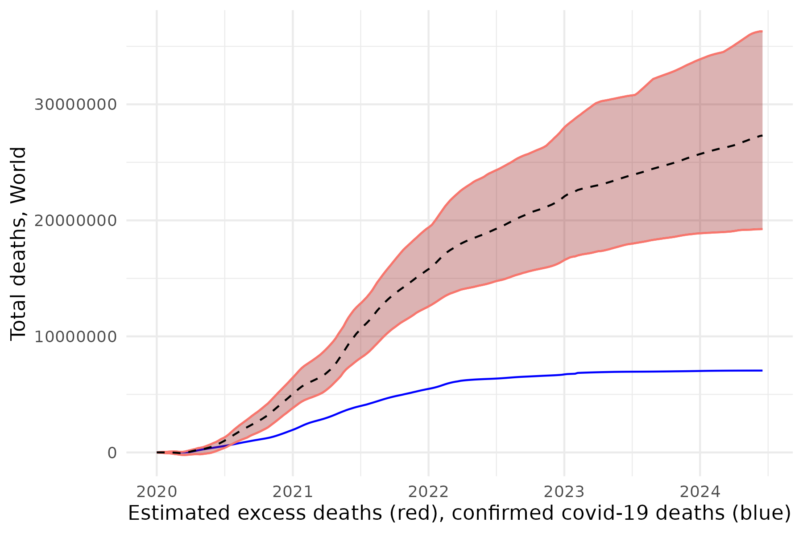

# The Economist's excess deaths model 
This repository contains the replication code and data for The Economist's excess deaths model, used to estimate the true death toll of the covid-19 pandemic.  

  
  
To replicate the model and export estimated excess deaths for a locality, please run the scripts 1, 2, and 3, in the scripts folder. As the model draws most of its data dynamically, you can use these scripts to generate updated estimates as time passes.
  

To read about what the model shows, see our [Briefing: Counting the dead.](https://www.economist.com/briefing/2021/05/15/there-have-been-7m-13m-excess-deaths-worldwide-during-the-pandemic)     

To understand how we constructed it, see our [methodology.](https://www.economist.com/ExcessDeathsModel)   

  
A special thanks to all our sources and to those who have made the data to create these estimates available. Within script 1, the source for each variable is given as the data is loaded, with the exception of our sources for excess deaths data, which can be found on our free-to-read [excess deaths tracker](https://www.economist.com/graphic-detail/coronavirus-excess-deaths-tracker). 
